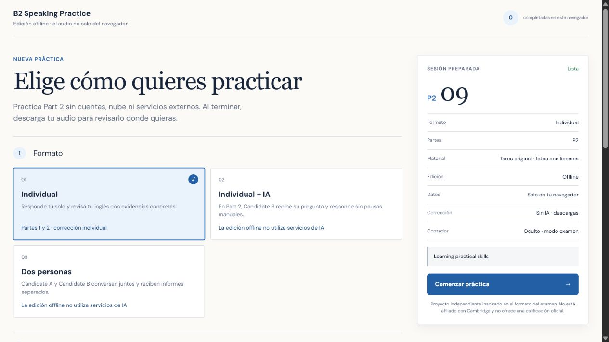
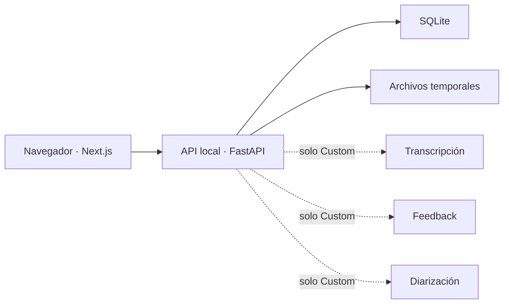

<p align="center">
  
</p>

<h1 align="center">B2 Speaking Practice</h1>

<p align="center">
  Una sala de práctica de B2 First que puedes ejecutar en tu propio ordenador.<br />
  Sin cuentas, sin anuncios y con tus datos bajo control.
</p>

<p align="center">
  <a href="https://github.com/antoniorjmnz/b2-speaking-practice/actions/workflows/ci.yml"></a>
  <a href="LICENSE"></a>
</p>

<p align="center">
  <a href="#pruébalo-en-local">Pruébalo</a> ·
  <a href="#offline-o-custom">Offline o Custom</a> ·
  <a href="docs/CUSTOM_MODE.md">Configurar proveedores</a>
</p>



No intenta sustituir a un profesor ni adivinar una nota oficial. Está pensado para repetir el
formato del examen, entrenar los tiempos y revisar muestras de habla con más calma.

## Pruébalo en local

Necesitas [Docker Desktop](https://www.docker.com/products/docker-desktop/) y tres comandos:

```bash
git clone https://github.com/antoniorjmnz/b2-speaking-practice.git
cd b2-speaking-practice
docker compose up --build
```

Abre <http://localhost:3000>. En Windows también puedes ejecutar `run-offline.bat`.

La edición que arranca por defecto es privada: ofrece Part 2 individual, conserva la grabación en
el navegador y permite descargar el audio al terminar. Los puertos solo se abren en tu propio
ordenador.

## Offline o Custom

| | Offline | Custom |
| --- | --- | --- |
| Para empezar | No requiere configuración | Utiliza tus propios proveedores |
| Prácticas | Part 2 individual | Part 1 individual, Part 2 y Part 3 en pareja |
| Transcripción y feedback | No | Sí, si los configuras |
| Candidato virtual | No | Opcional |
| Datos | La grabación no sale del navegador | Se envía únicamente a tus proveedores |
| Cuentas | No | No |

Para activar Custom:

```bash
cp .env.custom.example .env.custom
# Añade tus propias credenciales a .env.custom
docker compose -f compose.yaml -f compose.custom.yaml up --build
```

En PowerShell, sustituye el primer comando por
`Copy-Item .env.custom.example .env.custom`. La guía completa está en
[docs/CUSTOM_MODE.md](docs/CUSTOM_MODE.md).

## Qué hay dentro

- Una interfaz de práctica con instrucciones y tiempos similares al formato del examen.
- Part 1 individual, Part 2 individual o con candidato virtual y Part 3 para dos personas.
- Grabación, transcripción, diarización y un informe separado para cada candidato cuando el
  propietario conecta esos servicios.
- Tareas originales y fotografías con licencia trazable.
- Progreso guardado en el navegador, sin perfiles ni contraseñas.
- Next.js y FastAPI, con SQLite y almacenamiento local como punto de partida.

<details>
<summary><strong>Ver la arquitectura</strong></summary>



En Offline, el audio de Part 2 ni siquiera se envía a la API.

</details>

<details>
<summary><strong>Desarrollo sin Docker</strong></summary>

Requisitos: Node.js 20.9+, pnpm 11 y Python 3.12.

```powershell
Copy-Item apps/web/.env.example apps/web/.env.local
Copy-Item apps/api/.env.example apps/api/.env

python -m venv apps/api/.venv
apps/api/.venv/Scripts/python.exe -m pip install --upgrade pip
apps/api/.venv/Scripts/python.exe -m pip install -e "./apps/api[dev]"
pnpm install
pnpm dev
```

En macOS/Linux utiliza `apps/api/.venv/bin/python`.

</details>

## Comprobaciones

```bash
pnpm check
pnpm test:e2e
pnpm security:audit
```

La integración continua ejecuta lint, tipos, pruebas, build y auditoría de dependencias.

## Contenido, privacidad y licencia

- [Procedencia del contenido](docs/CONTENT.md)
- [Avisos y atribuciones](NOTICE.md)
- [Política de seguridad](SECURITY.md)
- [Licencia MIT](LICENSE)

El repositorio no redistribuye sample papers, fotografías ni preguntas oficiales de Cambridge.
No utilices grabaciones reales sin el consentimiento de todas las personas participantes.

> Proyecto independiente y formativo. No está afiliado con Cambridge University Press &
> Assessment y no ofrece una calificación oficial.
