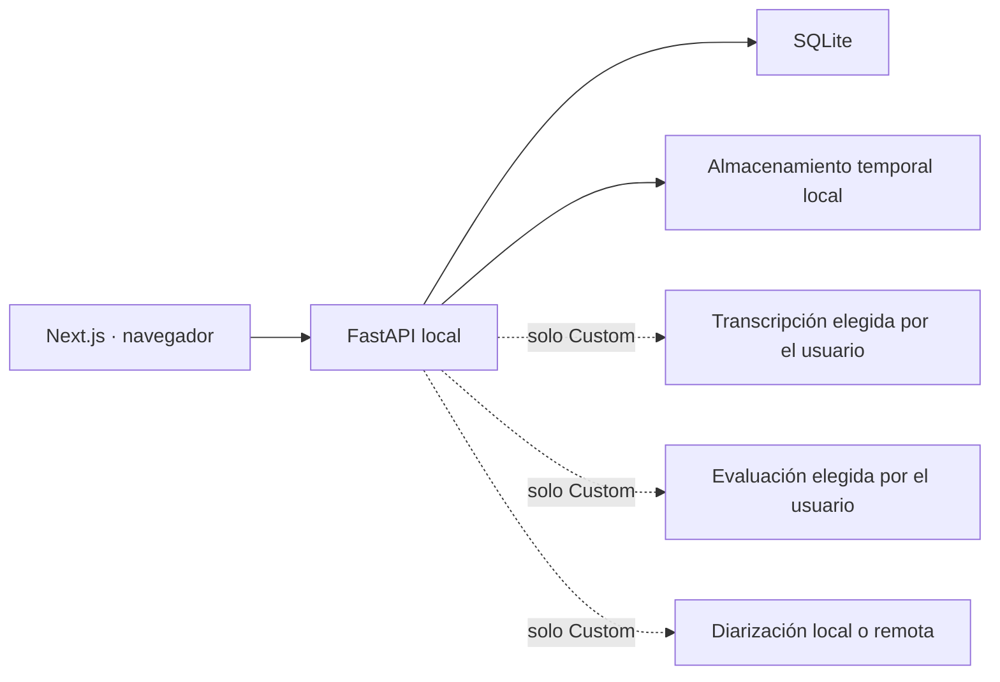

# B2 Speaking Practice

Aplicación autogestionable para practicar el formato oral de B2 First de manera individual, con
un compañero de IA opcional o con dos candidatos. Controla los tiempos, graba la práctica y, si
el propietario conecta sus propios proveedores, genera transcripción y feedback independiente.

> Proyecto independiente y formativo. No está afiliado con Cambridge University Press &
> Assessment, no sustituye a un profesor y no proporciona una calificación oficial.

## Dos formas de utilizarlo

### Offline — sin cuentas, claves ni servicios externos

La edición Offline ofrece Part 2 individual. La tarea se sirve desde tu propio ordenador y la
grabación permanece dentro del navegador: al terminar puedes descargar el audio y las fotografías.
No se envía el audio al backend ni a un proveedor de IA.

Requisito: [Docker Desktop](https://www.docker.com/products/docker-desktop/).

```bash
docker compose up --build
```

En Windows también puedes ejecutar `run-offline.bat`. Después abre
<http://localhost:3000>. Por defecto, Docker expone la web y la API únicamente en tu propio
ordenador, no al resto de la red local.

### Custom — tus proveedores, tus claves

Custom habilita la transcripción, la evaluación, el candidato IA y la diarización cuando los
proveedores correspondientes están configurados.

```bash
cp .env.custom.example .env.custom
# Edita .env.custom y añade únicamente tus propias credenciales.
docker compose -f compose.yaml -f compose.custom.yaml up --build
```

En PowerShell, usa `Copy-Item .env.custom.example .env.custom` para crear el archivo. Las claves
solo se leen en FastAPI y nunca deben usar el prefijo `NEXT_PUBLIC_`.

Consulta [Custom mode](docs/CUSTOM_MODE.md) antes de activar proveedores externos.

## Qué incluye la edición pública

- Next.js 16, React 19, TypeScript y Tailwind CSS.
- FastAPI, SQLite y almacenamiento local por defecto.
- Part 1 individual, Part 2 individual y Part 3 para dos candidatos en el perfil Custom.
- Temporizadores del formato de práctica y voz de examinadora pregrabada.
- Separación de candidatos mediante proveedor intercambiable.
- Evaluación estructurada con evidencias verificables y controles objetivos.
- Progreso local en el navegador, sin usuarios ni contraseñas.
- Borrado automático de las sesiones y grabaciones temporales.
- Pruebas unitarias, API y Playwright.

El perfil Offline oculta las funciones que necesitarían servicios externos. El perfil Custom no
incluye ninguna cuenta ni crédito: cada instalación aporta sus propias claves o conecta modelos
locales.

## Arquitectura



Offline no realiza las conexiones discontinuas del diagrama. En Part 2 privado, el audio ni
siquiera abandona el navegador.

## Desarrollo sin Docker

Requisitos: Node.js 20.9+, pnpm 11 y Python 3.12.

```powershell
Copy-Item apps/web/.env.example apps/web/.env.local
Copy-Item apps/api/.env.example apps/api/.env

python -m venv apps/api/.venv
apps/api/.venv/Scripts/python.exe -m pip install --upgrade pip
apps/api/.venv/Scripts/python.exe -m pip install -e "./apps/api[dev]"
pnpm install
pnpm dev
```

En macOS/Linux utiliza `apps/api/.venv/bin/python`.

## Calidad

```bash
pnpm check
pnpm test:e2e
pnpm security:audit
```

La integración continua ejecuta instalación reproducible, auditoría de dependencias, lint,
tipos, pruebas, build y E2E.

## Contenido y licencias

El repositorio público contiene únicamente tareas originales y fotografías con licencia trazable.
No redistribuye los sample papers, fotografías ni preguntas oficiales de Cambridge. Consulta
[CONTENT.md](docs/CONTENT.md) y [NOTICE.md](NOTICE.md).

El código se distribuye bajo la [licencia MIT](LICENSE). Los recursos visuales conservan las
condiciones indicadas en sus manifiestos.

## Privacidad

- No hay cuentas, contraseñas ni perfiles de usuario.
- Las preferencias de práctica se guardan localmente en el navegador.
- Las sesiones del backend son anónimas y temporales.
- Offline no necesita ninguna API key.
- Custom envía datos únicamente a los proveedores que configure el propietario.

No utilices grabaciones reales sin el consentimiento de todas las personas participantes.
